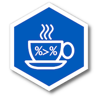

# Setting up a Cabinet Office 'Coffee & Coding' group


```{r include=FALSE}

library(tidyverse)
library(janitor)
library(govstyle)

dt_cc <- read_csv("~/Downloads/Cabinet Office Coffee & Coding_ Interest Form (Responses) - Form responses 1.csv") %>% clean_names()

names(dt_cc) <- c(
  "timestamp", 
  "interest", 
  "when_am", 
  "when_pm", 
  "frequency",
  "location",
  "skill_general_coding",
  "skill_r",
  "skill_python",
  "skill_big_data", 
  "skill_traditional_stats",
  "skill_modern_stats",
  "skill_software_development",
  "skill_data_visualisation",
  "contrib_yn",
  "contrib_what",
  "contrib_details",
  "other_comments",
  "email"
)

skill_convert <- function(x) {
  y <- case_when(
    str_detect(x, "^No") ~ "None",
    str_detect(x, "^Aware") ~ "Aware",
    str_detect(x, "^Working") ~ "Working",
    str_detect(x, "^Practitioner") ~ "Practitioner",
    TRUE ~ NA_character_
  ) %>% factor(levels = c("None", "Aware", "Working", "Practitioner"),
               ordered = TRUE)
  
  return(y)
  
}

dt_cc2 <- dt_cc %>%
  mutate(
    timestamp = lubridate::dmy_hms(timestamp),
    interest = case_when(
      str_detect(interest, "^High") ~ "High",
      str_detect(interest, "^General") ~ "General",
      str_detect(interest, "^Specific") ~ "Limited",
      TRUE ~ "None"
    ) %>%
      factor(
        levels = c("None", "Limited", "General", "High"),
        ordered = TRUE
      ),
    when_mon_am = str_detect(when_am, "Monday"),
    when_tue_am = str_detect(when_am, "Tuesday"),
    when_wed_am = str_detect(when_am, "Wednesday"),
    when_thu_am = str_detect(when_am, "Thursday"),
    when_fri_am = str_detect(when_am, "Friday"),
    when_mon_pm = str_detect(when_pm, "Monday"),
    when_tue_pm = str_detect(when_pm, "Tuesday"),
    when_wed_pm = str_detect(when_pm, "Wednesday"),
    when_thu_pm = str_detect(when_pm, "Thursday"),
    when_fri_pm = str_detect(when_pm, "Friday"),
    frequency = case_when(
      str_detect(frequency, "^Fortnightly") ~ "Fortnightly",
      TRUE ~ frequency
    ) %>%
      factor(
        levels = c("Weekly", "Fortnightly", "Monthly"),
        ordered = TRUE
      ),
    location = case_when(
      str_detect(location, "^In the same") ~ "Same location",
      str_detect(location, "^I will only") ~ "Hangouts only",
      str_detect(location, "^Sessions should") ~ "Regularly spread",
      str_detect(location, "^No preference") ~ "No preference",
      TRUE ~ location
    ) %>%
      factor(
        levels = c(
          "No preference",
          "Same location",
          "Regularly spread",
          "Hangouts only"
        ),
        ordered = TRUE
      ),
    contrib_yn = factor(
      contrib_yn,
      levels = c("No", "Yes"),
      ordered = TRUE
    ),
    contrib_w_project_done = str_detect(contrib_what, "project I've completed"),
    contrib_w_project_done = str_detect(contrib_what, "project that's still"),
    contrib_w_method = str_detect(contrib_what, "analytical method"),
    contrib_w_software = str_detect(contrib_what, "software/technology"),
  ) %>%
  mutate_at(vars(starts_with("skill_")), skill_convert) %>%
  select(-when_am, -when_pm, -contrib_what) %>%
  mutate_at(vars(starts_with("when"), starts_with("contrib_w")), as.numeric)
  


```


::: {style="float:right;position:relative;margin:10px"}

:::

The aim of [Coffee & Coding meetups](https://ukgovdatascience.github.io/rap-website/resource-coffee-and-coding.html) is to nurture, enable and encourage a vibrant, supportive and inclusive coding community at an organisation. Coffee & Coding provides a regular opportunity for people within an organisation who are interested in coding to share skills and knowledge, provide advice and guidance to each other and generally network and get to know each other.

Data science/analytical Coffee & Coding sessions are already established in at least seven departments (BEIS, DfE, DfT, DHSC, MOD, MOJ & ONS) and there’s an active [#coffee-and-coding channel](https://govdatascience.slack.com/messages/CDMCN3Y7J/convo/C0NF51LE4-1558020122.025000/) on the cross-government data science Slack team. With growing interest in coding and data science methods in the Cabinet Office, we're investigating starting our own Coffee & Coding sessions to provide a space to talk and learn about using coding skills for analysis.

So we ran a survey in May 2019 to guage interest across the Cabinet Office's analytical community. This page presents the results of that survey.

### Level of interest

A total of `r nrow(dt_cc2)` people took part in the survey. Unsurprisingly, nobody that took part in the survey said they had a low interest. Most people said they had a 'general interest', meaning their attendence would depend on their diary, while a small number said it would depend on specific session content or that they had a 'high interest' and would prioritise attendance.

```{r echo=FALSE, fig.align="center", fig.height=4, fig.width=8}

gdt <- dt_cc2 %>% drop_na(interest) %>% count(interest)

ggplot(gdt, aes(x = interest, y = n)) +
  geom_bar(stat = "identity", 
           position = "stack", 
           fill = gov_cols["govuk_blue"]) +
  geom_text(aes(label = n), nudge_y = 1, colour = gov_cols["govuk_blue"],
            fontface = "bold") +
  theme_gov(base_size = 16) +
  theme(
    axis.title.y = element_blank(),
    axis.text.y = element_blank(),
    axis.title.x = element_blank()
  )

```

### Frequency

While most opted for monthly frequency, a substantial minority indicated a preference for fortnightly sessions, only one person indicated a desire for weekly Coffee and Coding sessions.

```{r echo=FALSE, fig.align="center", fig.height=4, fig.width=8}

gdt <- dt_cc2 %>% drop_na(frequency) %>% count(frequency)

ggplot(gdt, aes(x = frequency, y = n)) +
  geom_bar(stat = "identity", 
           position = "stack", 
           fill = gov_cols["turquoise"]) +
  geom_text(aes(label = n), nudge_y = 1, colour = gov_cols["turquoise"],
            fontface = "bold") +
  theme_gov(base_size = 16) +
  theme(
    axis.title.y = element_blank(),
    axis.text.y = element_blank(),
    axis.title.x = element_blank()
  )

```

### When?

Friday morning was the strongest preference for when sessions should be run, but there was also a strong showing for Tuesday/Thursday afternoons. Monday mornings were the least preferred, followed by Monday afternoons - so at the very least, we know not to hold them on Mondays!

```{r echo=FALSE, fig.align="center", fig.height=4, fig.width=8}

gdt <- dt_cc2 %>% select(starts_with("when")) %>%
  gather(key = "when", value = "value") %>%
  filter(value > 0) %>%
  count(when) %>%
  mutate(day = str_replace(when, "when_", "") %>% str_replace("_[ap]m", "") %>%
           factor(levels = c("mon", "tue", "wed", "thu", "fri"), 
                  ordered = TRUE),
         time = str_replace(when, "when_.*_", "") %>% 
           factor(levels = c("pm", "am"), ordered = TRUE))

ggplot(gdt, aes(x = day, y = time)) +
  geom_point(aes(colour = n), shape = 15, size = 20) +
  geom_text(aes(label = n, colour = n),
             colour = "gray40",
            fontface = "bold",
            nudge_x = 0.35) +
  theme_gov(base_size = 16, axes = "xy") +
  scale_color_distiller(palette = "RdPu", direction = 1)

```

### Location

The Cabinet Office is a multi-site organisation, so we also asked about location preferences. Only a few respondents had no preference or would only join via Google Hangouts, a plurality of respondents opted for the same location, but a similar number of respondents indicated a desire for regular rotation around Cabinet Office sites.

```{r echo=FALSE, fig.align="center", fig.height=4, fig.width=8}

gdt <- dt_cc2 %>% drop_na(location) %>% count(location)

ggplot(gdt, aes(x = location, y = n)) +
  geom_bar(stat = "identity", 
           position = "stack", 
           fill = gov_cols["orange"]) +
  geom_text(aes(label = n), nudge_y = 1, colour = gov_cols["orange"],
            fontface = "bold") +
  theme_gov(base_size = 16) +
  theme(
    axis.title.y = element_blank(),
    axis.text.y = element_blank(),
    axis.title.x = element_blank()
  )

```


### Skills mix

There is no set agenda for Coffee & Coding sessions, but to help understand the audience/capability of analysts we asked about proficiency in eight skill areas:

* General coding skills (e.g. variables, functions, scripting)
* R
* Python
* Working with big/complex data
* Interactive data exploration/visualisation
* 'Traditional' advanced techniques (e.g. factor and cluster analysis, multilevel regression)
* 'Modern' advanced techniques (e.g. machine learning, natural language processing)
* Software development (e.g. writing R packages/Python libraries)

Respondents were asked to rate their skill level as:

* *None* - having no knowledge of the skill
* *Aware* - having some knowledge of skill
* *Working* - can use and apply their knowledge of the skill
* *Practitioner* - can help others to learn and apply the skill

Around half of respondents had experence of working with big data and general coding skills, and only a small number had no awareness. Most respondents also had at least some awareness of data visualisation, R, traditional techniques, and (to some degree) Python - with a fair number having at least working level proficiency. There were only a limited number of respondents with working or practitioner levels of knowledge in either modern techniques and software development.

```{r echo=FALSE, fig.align="center", fig.height=6, fig.width=8}

gdt <- dt_cc2 %>% select(starts_with("skill")) %>%
  gather(key = "skill") %>%
  mutate(skill = str_replace(skill, "skill_", "") %>%
           str_replace("_"," ") %>%
           str_to_sentence()) %>%
  count(skill, value) %>%
  spread(key = value, value = n) %>%
  rowwise() %>%
  mutate(
    ord = sum(Practitioner * 4, Working * 3, Aware * 2, None * 1)
  ) %>%
  gather(key = "value", value = "n", -skill, -ord) %>%
  arrange(desc(ord), skill) %>%
  mutate(skill = fct_inorder(skill) %>% fct_rev(),
         value = skill_convert(value))

valcols <- c("None" = "white", "Aware" = "gray20", "Working" = "gray20", 
             "Practitioner" = "white")

ggplot(gdt, aes(x = skill, y = n, fill = value)) +
  geom_col(position = "stack", width = 0.6) +
  geom_text(aes(label = n, colour = value), 
            position = position_stack(vjust = 0.5), fontface = "bold", 
            show.legend = FALSE) +
  theme_gov(base_size = 16, axes = "y") +
  theme(
    legend.position = "bottom",
    legend.key.size = unit(0.75, "line"),
    axis.title.x = element_blank(),
    axis.text.x = element_blank(),
    axis.title.y = element_blank()
  ) + 
  scale_fill_brewer(palette = "PiYG", direction = 1, 
                    guide = guide_legend(title = "", label = TRUE, ncol = 2)) +
  scale_color_manual(values = valcols) +
  scale_y_reverse() +
  coord_flip()

```

